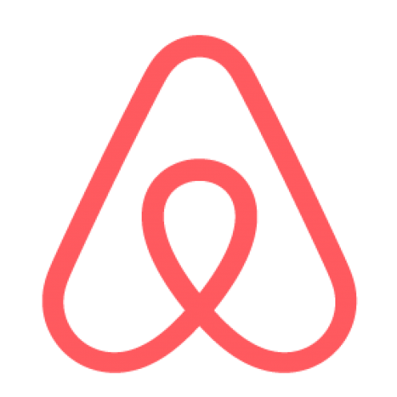

# Hi there, I'm Ahammed Saad [asaad227] 👋

## I'm a Husband, Father and a Developer!!

- 🌱 I’m currently developing and exploring more fontend, backend and testing tools
- 👯 I’m looking to collaborate with other content creators
- 🎯 2022 - learning new things a day or cementing what I have learned. 
- ⚡ Fun fact: I like party and hanging out with family and friends

### Connect with me:

&nbsp;&nbsp;

&nbsp;&nbsp;
<!-- #gh-light-mode-only)
#gh-dark-mode-only) -->

### Languages and Tools:

 
   
  

  
:zap: GitHub Stats

 
  
 

 

